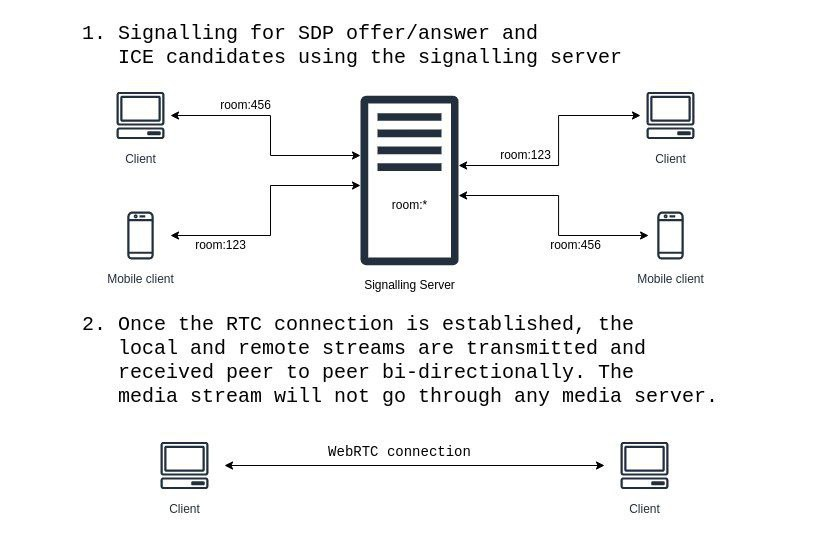

# Sigsvr

- Signalling server for WebRTC P2P app built from scratch using channels.

To start your Phoenix server:

- Install dependencies with `mix deps.get`
- Start Phoenix endpoint with `mix phx.server` or inside IEx with `iex -S mix phx.server`

To test connection:

- open browser
- open browser console
```JavaScript
let ws = new WebSocket("ws://localhost:4000/socket/websocket")
ws
```

Architecture:


Deployment:
- The signalling server is built as a docker container and is deployed to heroku.
- In the runtime.exs file,
  ```Elixir
  host = System.get_env("PHX_HOST") || "<the signalling server's dns/hostname/domain>"
  ...
  check_origin: [
    #list of client domains/host urls that will access this server
    #ie. localhost:4000 <- if you want to test out from your localhost clients
  ]
  ```